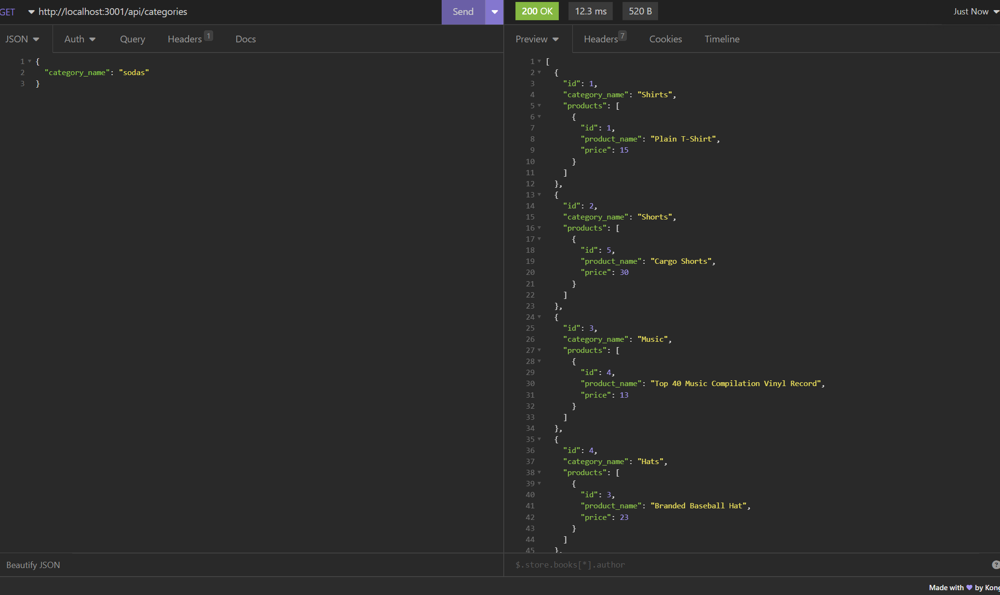

# Title
Ecommerce Backend Demo

# Table of Contents
[Description](#description)

[Installation](#instalation)

[Usage](#usage)

[Screenshot](#screenshots)

[Contributors](#contributors)

[Questions](#questions)

## Description
A demo for a backend that can be used by a business

## Installation
Clone the repo and run npm i to install the dependencies, after that run npm seed to seed the database, and finally use npm start to start the server

## Usage
For a business that wants to keeo track of it's products using categories and product tags

## Screenshots

## Contribution
Mohammad Komol Hasan

## Questions
GitHub: MKHLink

Email: likhonhasankomol@gmail.com
    